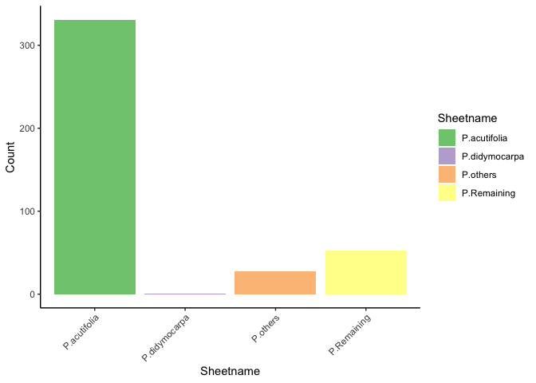

Appendix README
================

To facilitate formatting appendix files for specimens reviewed, an
Rscript was used to read in a column subset from each sheetname in the
`specimens.xlsx` external data from
[`ThesisPackage`](https://github.com/jasonratcliff/ThesisPackage). A
*.tsv* file is written from entries without appendix completion (missing
values in variable `App.A`). \(\LaTeX\) formatting is substituted for
collection and collection number values.

``` bash
Rscript appendix_script.R
```

``` r
appendix_files <- list.files(pattern = "*_appendix.tsv")

missing_appendixes <- purrr::map_dfr(
  .x = appendix_files, function(appendix) {
    readr::read_tsv(file = appendix,
                    col_types = paste0(rep("c", times = 10), collapse = "")) %>%
      dplyr::mutate(
        sheetname = gsub(pattern = "_appendix.tsv", replacement = "",
                         x = appendix)
      )
  })

ggplot(data = missing_appendixes) +
  geom_bar(aes(x = sheetname, fill = sheetname)) +
  scale_fill_brewer("Sheetname", type = "qual") +
  theme_classic() +
  theme(axis.text.x = element_text(angle = 45, hjust = 1)) +
  labs(x = "Sheetname", y = "Count")
```

<!-- -->

``` r
fs::file_delete(path = appendix_files)
```

# Images

Herbarium voucher specimens were photographed and cataloged by locality.
The following name convention was used for Digikam files:

`<Collector>_<Collection Number>_<Herbarium Code(-Accession Number)>`

Where:

  - **Collector** is a character string of the botanist’s last name
  - **Collection Number** is an integer for voucher specimen collection
    number
  - **Herbarium Code** is a two letter uppercase string denoting
      - **-Accession Number** is a possible voucher-specific herbarium
        accession

To identify which specimens have been photographed, `digi_find.R` writes
a *.xlsx* file with

``` bash
Rscript digi_find.R
```

``` r
digikam <- readxl::read_excel("digikam.xlsx") %>%
  dplyr::mutate(
    path_check = purrr::map_chr(
      .data$path, function(x) ifelse(is.na(x), "Missing", "Match")) %>%
      factor(., levels = c("Missing", "Match"))
  )

ggplot(data = digikam) +
  geom_bar(aes(x = excel_sheet, fill = path_check)) +
  scale_fill_discrete("Matched Filepath") +
  theme_classic() +
  theme(axis.text.x = element_text(angle = 45, hjust = 1)) +
  labs(x = "Excel Sheetname", y = "Count")
```

<!-- -->

## digiKam Photo Organization

To search subdirectories, a string passed from the command line is
wrapped in **\*** wildcards to recursively find the expression from
subdirectory file names. If found, the file name including the relative
path from the respective subdirectory is printed. `digi_find.sh` accepts
a single positional argument passed to the bash `find` utility for
printing relative paths to specimens in the photo subdirectory. Search
by:

  - Collector

<!-- end list -->

``` bash
./digi_find.sh "Hayden"
```

    ##   Searching for filename string: 'Hayden'
    ##   /Physaria/Wyoming/Big Horn, WY/Unknown Locality/Hayden_sn_MO-3093900_v1.tiff
    ##   /Physaria/Wyoming/Hot Springs/Unknown Locality/Hayden_sn_MO-137159.tiff
    ##   /Physaria/Wyoming/Hot Springs/Unknown Locality/Hayden_sn_MO-1923237.tiff
    ##   /Physaria/Wyoming/Park, WY/Hayden_sn_MO-3833625.tiff
    ##   /Physaria/Wyoming/Teton, WY/Hayden_sn_MO-3833631.tiff

  - Collection Number

<!-- end list -->

``` bash
./digi_find.sh "11931"
```

    ##   Searching for filename string: '11931'
    ##   /Physaria/Montana/Fergus/P_saximontana/Hitchcock_11931_NY.tiff
    ##   /Physaria/Montana/Fergus/P_saximontana/Hitchcock_11931_MONT.tiff
    ##   /Physaria/Montana/Fergus/P_saximontana/Hitchcock_11931_UTC.tiff
    ##   /Physaria/Montana/Fergus/P_saximontana/Hitchcock_11931_CAS.tiff
    ##   /Physaria/Montana/Fergus/P_saximontana/Hitchcock_11931_RM.tiff
    ##   /Physaria/Montana/Fergus/P_saximontana/Hitchcock_11931_MO.tiff
    ##   /Physaria/Montana/Fergus/P_saximontana/Hitchcock_11931_UC.tiff

  - Herbarium Accession

<!-- end list -->

``` bash
./digi_find.sh MO-3093900
```

    ##   Searching for filename string: 'MO-3093900'
    ##   /Physaria/Wyoming/Big Horn, WY/Unknown Locality/Hayden_sn_MO-3093900_v1.tiff
