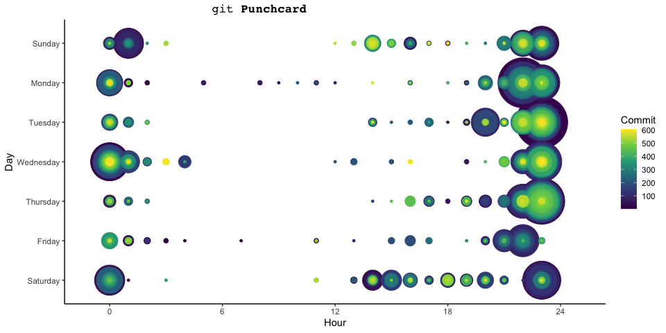

<!-- README.md is generated from README.Rmd. Please edit that file -->

# Thesis

<!-- badges: start -->
<!-- # https://usethis.r-lib.org/reference/badges.html -->
<!-- # https://lifecycle.r-lib.org/articles/communicate.html -->

<!-- badges: end -->

<!-- -->
## `Makefile` Targets

GNU [make](-%20https://www.gnu.org/software/make/) is used for rendering
`pdf` and `HTML` output files. The project `Makefile` calls
`bookdown::render_book()` and requires a valid
[Pandoc](https://pandoc.org/) installation. For RStudio users, an
installation is bundled with the IDE. To identify the install path, try
`rmarkdown::find_pandoc()`.

-   Update figure *.png* & *.pdf* files via `inst/script`

<!-- -->

    make figures

-   Install package via `devtools::install_local("~/Thesis")`
    -   Force update without `DESCRIPTION` version

<!-- -->

    make package

-   Render `xaringan` slides to *.html* output

<!-- -->

    make -C inst/slides all

-   Render `LaTeX` *.pdf* and `gitbook` *.png*

<!-- -->

    make -C inst/manuscript pdf
    make -C inst/manuscript html

