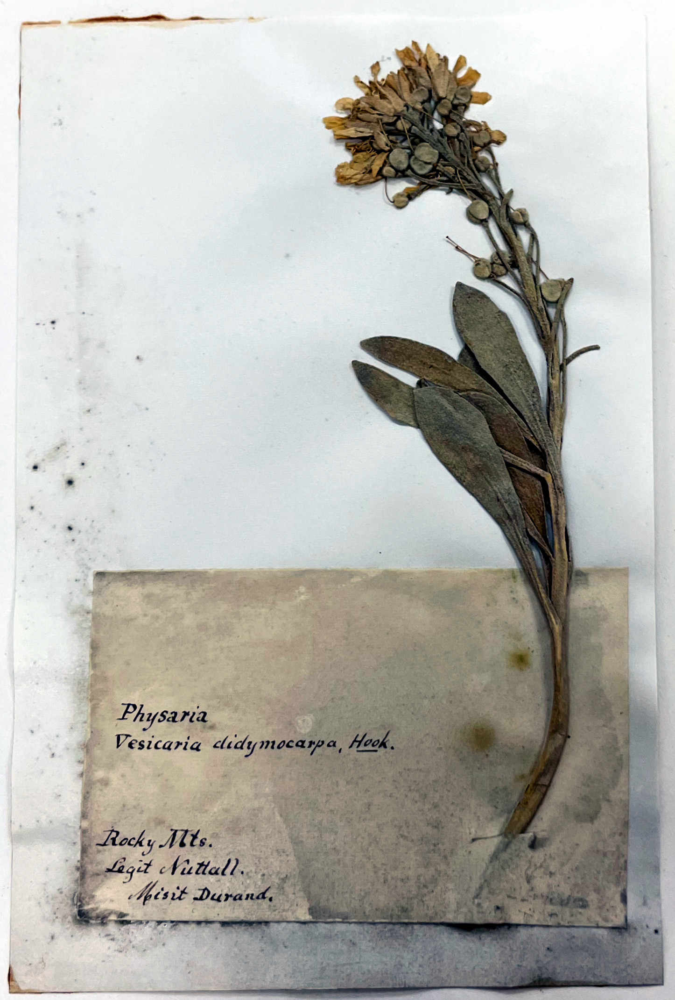

<!-- README.md is generated from README.Rmd. Please edit that file -->

# Thesis 

<!-- badges: start -->

[](https://gitpod.io/#https://github.com/jasonratcliff/thesis)
[](https://lifecycle.r-lib.org/articles/stages.html#experimental)
<!-- badges: end -->

> The systematics of *Physaria* sensu stricto from Wyoming and
> surrounding areas

## Summary

This repository includes the source code, data, and manuscript contents
for thesis work related to the systematic botany and molecular
phylogenetics for a subset of *Physaria* (Brassicaceae) from the western
Great Plains and Intermountain West.

## Installation

``` r
# Install development version from GitHub
devtools::install_github("jasonratcliff/thesis")
```
