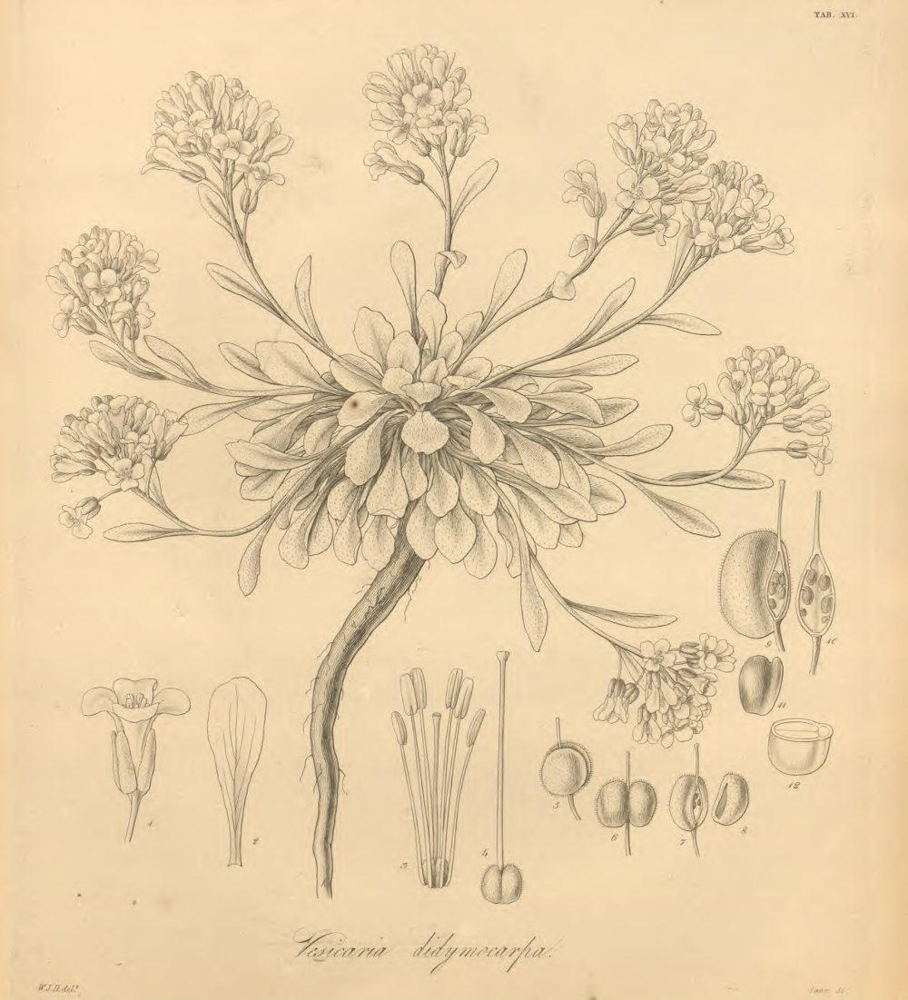

```{r setup, include=FALSE}
knitr::opts_chunk$set(echo = FALSE, message=FALSE, cache=TRUE)
knitr::opts_knit$set(root.dir = here::here())
library(magrittr)
library(tidyverse)
library(ggtext)  # remotes::install_github("clauswilke/ggtext")
library(ggtext)
library(ggmap)
library(elevatr)
library(rgdal)
library(knitr)
library(kableExtra)
library(ggtree)
library(scales)
```

```{r globals}
source("R/specimen_data.R")
source("R/specimen_tools.R")
source("R/map_tools.R")
source("R/trait_tools.R")
source("R/phylo_tools.R")
gg_borders <- map_borders(border_color = "black")

```

```{r beastData}

# Read in sequenced DNA specimen information including accession labels.
dna_specimens <-
  readr::read_csv(file = "data/1.specimens/dna_specimens.csv") %>%
  dplyr::rename(label = taxa_label)

# Combine herbarium specimen record information with sequence documentation.
dna_herbarium_spp <-
  purrr::pmap_dfr(dna_specimens,
    function(label, Collector, Collection_Number, ...) {

      # Subset total herbarium record data frame by collector and collection.
      dna_herbarium <-
        total_physaria[intersect(
          stringr::str_which(string = total_physaria$Collector,
                             pattern = Collector),
          stringr::str_which(string = total_physaria$Collection_Number,
                             pattern = as.character(Collection_Number))), ] %>%
        dplyr::mutate(Collection_Number = as.numeric(Collection_Number))

      # Join the herbarium records to matching sequencing specimen .csv rows.
      specimen_label = label
      dplyr::left_join(dplyr::filter(dna_specimens, label == specimen_label),
                       dna_herbarium, by = "Collection_Number")
}) %>% # Clean up a few columns and reorder for easy review.
  dplyr::select(label, Collection_Number, Collector.x, Collector.y,
                dplyr::contains("Physaria"), dplyr::contains("Taxon"),
                dplyr::contains("ID_"), Herbarium.x, Herbarium.y,
                State.x, State.y, County.x, County.y,
                Date, Date_parsed, Date_md, multiLocus,
                ID, App.A, dplyr::contains("Elev"), dplyr::contains("elev"),
                Latitude.x, Latitude.y, Longitude.x, Longitude.y,
                Imaged, TRS2, Notes, Rosulate, Caudex, Pubescence,
                Basal_leaf_trichomes, Fruit_trichomes, Stem_count,
                Stem_shape, Stem_length_dm, Petiole, Basal_leaf_length_cm,
                Basal_leaf_shape, Basal_leaf_margins, Cauline_leaf_length_mm,
                Cauline_leaf_shape, Cauline_leaf_margins, Racemes,
                Pedicel_shape, Pedicels_secund, Sepal_length_mm, Sepal_shape,
                Petal_color, Petal_length_mm, Petal_shape, Style_length_mm,
                Mature_fruit_length_mm, Mature_fruit_width_mm, Fruit,
                Mature_fruit_apices, Replum_pubescence, Inner_valve_pubescence,
                Ovule_number, Replum_shape, Seed_color, Seed_shape,
                Mature_seed_length_mm) %>%
  dplyr::rename(Latitude = Latitude.x, Longitude = Longitude.x)


```

```

class: animated, fadeIn
background-image: url("images/00.Hooker-1830-Map.png")
background-size: contain

## &nbsp;&nbsp;&nbsp;Overview

.left-footnote[

<em>Flora Boreali-Americana</em> (Hooker 1830)
https://about.biodiversitylibrary.org/

]

---

class: animated, fadeIn
background-image: url("images/00.Hooker-1830-Map-Franklin.png")
background-size: contain

.left-footnote[

<em>Flora Boreali-Americana</em> (Hooker 1830)

]

???

- Polar Expeditions
    - Auspices of Captain **Sir John Franklin**
        - British Royal Navy

- Two overland expeditions:
    - 1819-1822
    - 1825-1827
    
- 2nd Expedition
    - **Sir John Richardson**
        - Naval surgeon
        - Expedition naturalist
        - 2nd in command

---

class: animated, fadeIn
background-position: 18% 85%
background-image: url("images/00.Hooker-1830-Map.png")

.left-footnote[

<em>Flora Boreali-Americana</em> (Hooker 1830)

]

???

- In 1825, 2nd Expedition:
    - **Thomas Drummond**
        - *Assistant* to **expedition naturalist**

- Split from main party
    - *Cumberland House*

- Six months in Canadian Rockies by horesback
    - Perilous journey, grizzly encounter, low supplies
    - On return to *Carlton House*:
        - Encounters **David Douglas**

<br>

Hoeniger JFM. 2003. DRUMMOND, THOMAS. Dictionary of Canadian Biography, vol. 6 [Internet]. Toronto (Canada): University of Toronto/Université Laval; [cited December 22, 2019]. Available from http://www.biographi.ca/en/bio/drummond_thomas_6E.html

---

class: animated, fadeIn
background-position: 72% 0.1%
background-image: url("images/00.Hooker-1830-Map.png")

.left-footnote[

<em>Flora Boreali-Americana</em> (Hooker 1830)

]

???

- Franklin's Expeditions
    - Returned collections from:
        - Drummond
        - Douglas

- Sir William Jackson Hooker
    - Flora Boreali Americana
        - 2 volumes

---

class: animated, slideInUp

## Systematic History

### *Physaria* (Nuttall ex Torrey & A. Gray) A. Gray [Brassicaceae]

<div style="float: left; width: 45%;">
  
  <p style="font-size:15px; float: center;">
    <em>Flora Boreali-Americana</em> (Hooker 1830)
  </p>
</div>

---

## Systematic History

### *Physaria* (Nuttall ex Torrey & A. Gray) A. Gray [Brassicaceae]

<div style="float: left; width: 45%;">
  
  <p style="font-size:15px; float: center;">
    <em>Flora Boreali-Americana</em> (Hooker 1830)
  </p>
</div>

.pull-right[

.large[*Vesicaria*]

1. *V. ludoviciana*
2. *V. arctica*
3. _**V. didymocarpa**_, sp. nov.

]

???

- Hooker describes 3 species of *Vesicaria*
    - Formerly spp. of _**Alyssum**_

---

layout: true

## Systematic History

### *Vesicaria didymocarpa* Hooker

<div style="float: left; width: 45%;">
  
  <p style="font-size:15px; float: center;">
    <em>Flora Boreali-Americana 1</em> (Hooker 1830)
  </p>
</div>

---

.pull-right[

.large[Canadian Rocky Mountains]

- *Drummond*
    - Between 52º and 57º Latitude
      
- *Douglas* 
    - Of the **Columbia River**:
        - Kettle Falls, Washington
        - Wallawallah, Oregon

]

???

- Hudson Bay Company trading post
    - On Westward expansion:

> The far-seeing stateman and philosopher will look into the future, and keep pace with the mighty sweep of civilization in its onward course towards the setting sun...

<br>

Columbus O. Citizens' Committee, Medary S. 1843. Report on the Territory of Oregon:  American West Series [Internet]. Columbus [OH]: Ohio Statesman; [cited 2020 Jan 7]. Available from https://books.google.com/books?id=s3RNAAAAYAAJ

---

.pull-right[

.large[_**J. Hooker**_]

- Posited generic-level character
    - Based on fruit morphology

- Phenotype
    - Broad leaves
    - Stellate trichomes
    - Large yellow flowers
    - Deep sinuses
    
- Habit otherwise similar to *Vesicaria* spp.

]

---

layout: true

## Methods

---

```{r specimenCount}

# Calculate total number of specimens accounting for duplicated records.
specimen_count <-
  total_physaria %>%
  dplyr::select(Collector, Collection_Number, Date, Herbarium) %>%
  dplyr::mutate(row_id = 1:nrow(.)) %>%
  dplyr::mutate(Herbarium =
    stringr::str_remove_all(Herbarium, pattern = "\\[|\\]") %>%
    stringr::str_split(., pattern = ", +") %>%
      map_chr(., function(herbarium) {
        unlist(herbarium) %>% sort() %>%
          stringr::str_c(., collapse = " ")
        })) %>%
  dplyr::distinct(., Collector, Collection_Number, Date, Herbarium,
                  .keep_all = TRUE) %>% nrow()

```

.pull-left[

### Specimen Overview

- Herbarium Records
    - `r specimen_count` specimens

- 14 Herbaria

]

.pull-right[

### Lending Institutions

```{r herbaria}

data.frame(x = c("RM", "NY", "MO", "F", "ISTC", "MONTU", "MONT"),
           y = c("RSA-POM", "UC", "UTC", "GH", "US", "CAS", "IDS")) %>%
  knitr::kable(., col.names = NULL, format = "html") %>%
  kableExtra::kable_styling(bootstrap_options = "bordered", font_size = 14) %>%
  kableExtra::column_spec(c(1, 2), bold = TRUE)

```

]

---

---


---
layout: false

```{r rITSBayes, fig.asp=1.3}

tbl_ITS <-
  phylo_tbl(bayes_file = paste0("data/8.bayes/rITS-infile.nex.con.tre"),
            specimen_records = total_physaria)
ggtree_ITS <-
  phylo_ggplot(phylo_tbl_obj = tbl_ITS,
               phylo_layout = "rectangular", plot_title = "rITS Phylogeny",
               legend_col = 2, x_expand = 0.025, rate_offset = -1.5,
               legend_text = 10, text_tip_size = 3.3)
lemon::reposition_legend(aplot = ggtree_ITS, position = "top left", plot = TRUE)

```

---

```{r rpsBayes, fig.asp=1.3}

tbl_rps <-
  phylo_tbl(bayes_file = "data/8.bayes/rps-infile.nex.con.tre",
            specimen_records = total_physaria)
ggtree_rps <-
  phylo_ggplot(phylo_tbl_obj = tbl_rps, phylo_layout = "rectangular",
               plot_title = expression(paste(bolditalic("rps"),
                                                  bold(" intron Phylogeny"))),
               legend_col = 2, x_expand = 0.015,
               legend_text = 10, text_tip_size = 3.2)
lemon::reposition_legend(aplot = ggtree_rps, position = "top left", plot = TRUE)

```

---

```{r mlBayes, fig.asp=1.3}

tbl_phylo_ml <-
  phylo_tbl(bayes_file = "data/8.bayes/ml-infile.nex.con.tre",
            specimen_records = total_physaria)
ggtree_ml <-
  phylo_ggplot(phylo_tbl_obj = tbl_phylo_ml, phylo_layout = "rectangular",
               plot_title = "Multi-locus Phylogeny",
               legend_col = 2, x_expand = 0.025, rate_offset = -1.5,
               legend_text = 10, text_tip_size = 3.2)
lemon::reposition_legend(aplot = ggtree_ml, position = "top left", plot = TRUE)

```


```

---

```{r inteCompGgmap}

# Satellite distribution map
ggmap_spp_inte_comp <-
  (spp_inte_comp %>%
     dplyr::group_by(Physaria_syn) %>% filter(n() > 3) %>%
     map_ggmap(map_df = ., map_col = "Physaria_syn",
               gg_latitude = 42.2, gg_longitude = -109.5,
               gg_borders = gg_borders, size = 7, gg_map_type = "satellite",
               jitter_pos = c(0.05, 0.05), shape_opt = "Physaria_syn")) %>%
  map_themes(gg_map_obj = ., legend_title = "Prior Annotations")

ggmap_spp_inte_comp

```

## Western Wyoming Endemics | Distribution

```{r inteCompGgmapRect}

ggmap_spp_inte_comp +
  geom_rect(data = NULL, inherit.aes = FALSE, fill = NA,
            color = "black", size = 2,
            aes(xmin = -112, xmax = -109, ymin = 41, ymax = 44))

```

## Western Wyoming Endemics | Rosette Difference

```{r inteCompRosetteHist}

# Split trait ranges, calculate rosette difference, and combine priors.
traits_inte_comp <- spp_inte_comp %>%
  dplyr::filter(Longitude > -112, Longitude < -109,
                Latitude > 41, Longitude < 44)
traits_inte_stems <- continuous_tbl(trait_frame = traits_inte_comp,
                                    trait_name = "Stem_length_dm")
traits_inte_leaves <- continuous_tbl(trait_frame = traits_inte_comp,
                                     trait_name = "Basal_leaf_length_cm") %>%
  {dplyr::select(., Basal_leaf_length_cm_min,
                 Basal_leaf_length_cm_mid, Basal_leaf_length_cm_max)}
traits_inte_comp <-
  dplyr::bind_cols(traits_inte_stems, traits_inte_leaves) %>%
  dplyr::mutate(rosette_ratio = Stem_length_dm_max * 10 -
                  Basal_leaf_length_cm_max) %>%
  dplyr::filter(!is.na(rosette_ratio)) %>%
  dplyr::mutate(west_wyo_priors = purrr::map_chr(Physaria_syn,
    function(taxon) {
      ifelse(grepl(pattern =
        paste0("^Physaria ",
               paste("condensata", "dornii", "integrifolia", "acutifolia",
                     "didymocarpa ssp\\. didymocarpa", sep = "|")), taxon),
        yes = taxon, no = "Physaria spp.")
      })) %>%
  dplyr::mutate(west_wyo_factors = factor(west_wyo_priors,
    levels = c("Physaria condensata", "Physaria integrifolia",
               "Physaria acutifolia", "Physaria dornii",
               "Physaria didymocarpa ssp. didymocarpa")))

# Plot histogram of stem / basal leaf differences and facet by ID.
counts_inte_comp <- traits_inte_comp %>%
  dplyr::filter(!grepl("Physaria spp\\.", west_wyo_priors)) %>%
    dplyr::group_by(west_wyo_factors) %>% dplyr::summarize(counts = n()) %>%
  dplyr::mutate(counts = paste0("n=", counts)) %>%
  dplyr::mutate(x = rep(15.2, times = nrow(.)),
                y = rep(16.2, times = nrow(.)))

ggplot_inte_hist <-
  ggplot(traits_inte_comp %>% filter(!grepl("Physaria spp.", west_wyo_priors))) +
  geom_histogram(binwidth = 0.5, color = "black",
                 aes(x = rosette_ratio, fill = west_wyo_priors)) +
  geom_text(data = counts_inte_comp, aes(x = x, y = y, label = counts),
            hjust = 0) +
  facet_wrap(. ~ west_wyo_factors,
    labeller = labeller(west_wyo_factors = label_wrap_gen(22))) +
  scale_fill_discrete(labels =
    c("Physaria condensata" = "Physaria condensata",
      "Physaria integrifolia" = "Physaria integrifolia",
      "Physaria acutifolia" = "Physaria acutifolia",
      "Physaria dornii" = "Physaria dornii",
      "Physaria didymocarpa ssp. didymocarpa" =
        "Physaria didymocarpa \n   ssp. didymocarpa")) +
  theme(strip.text = element_text(face = c("bold.italic")),
        legend.text = element_text(face = "italic")) +
  labs(x = "Stem / Rosette Difference (cm)",
       y = "Binned Counts\n(by 0.5 cm)",
       fill = "Prior Annotation")

lemon::reposition_legend(ggplot_inte_hist, panel = "panel-3-2",
                         position = "top left")

rm(traits_inte_stems, traits_inte_leaves, counts_inte_comp, ggplot_inte_hist)

```

## Western Wyoming Endemics | Rosette Difference

```{r inteCompRosetteMap}

# Remove outliers by filter to specimens with difference < 15.
traits_inte_comp_filter <-
  dplyr::filter(traits_inte_comp, rosette_ratio < 15)

# Map traits
ggplot_inte_rosette1 <-
  gg_borders +
  geom_jitter(data = traits_inte_comp_filter %>%
                dplyr::filter(west_wyo_priors == "Physaria spp."),
              inherit.aes = FALSE, na.rm = TRUE, size = 2,
              aes(x = Longitude, y = Latitude,
                  fill = rosette_ratio, shape = west_wyo_priors)) +
  geom_jitter(data = traits_inte_comp_filter %>%
                dplyr::filter(grepl("Physaria acutifolia", west_wyo_priors)),
              inherit.aes = FALSE, na.rm = TRUE, size = 3, alpha = 0.5,
              aes(x = Longitude, y = Latitude,
                  fill = rosette_ratio, shape = west_wyo_priors)) +
  geom_jitter(data = traits_inte_comp_filter %>%
                dplyr::filter(grepl(paste0("dornii|condensata|",
                                           "integrifolia|didymocarpa"),
                                    west_wyo_priors)),
              inherit.aes = FALSE, na.rm = TRUE, size = 4,
              color = "black", alpha = 0.7,
              aes(x = Longitude, y = Latitude,
                  fill = rosette_ratio, shape = west_wyo_priors)) +
  coord_fixed(xlim = grDevices::extendrange(c(-112, -109), f = 0),
              ylim = grDevices::extendrange(c(41, 44), f = 0)) +
  theme(panel.border = element_rect(colour = "slategrey", fill=NA, size=3)) +
  scale_fill_gradientn(name = "Difference\n   (cm)",
    colors = RColorBrewer::brewer.pal(n = 6, name = "YlGnBu")) +
  scale_shape_manual(name = "Prior Annotations",
                     values = c("Physaria spp." = 3,
                                "Physaria acutifolia" = 21,
                                "Physaria didymocarpa ssp. didymocarpa" = 23,
                                "Physaria integrifolia" = 24,
                                "Physaria dornii" = 22,
                                "Physaria condensata" = 25)) +
  xlab("Longitude") +
  ylab("Latitude") +
  ggtitle("Stem / Rosette Difference")

ggplot_inte_rosette1

```

## Western Wyoming Endemics | Rosette Difference

```{r inteCompRosetteZoom}

ggplot_inte_rosette1 +
  geom_rect(data = NULL, inherit.aes = FALSE, fill = NA,
            color = "yellow", size = 2,
            aes(xmin = -111.5, xmax = -110, ymin = 41, ymax = 42.5))

```

## *Physaria dornii* and *P. condensata*

```{r inteDornCondRosette}

# Subset dornii and condensata specimens
traits_dorn_cond <- traits_inte_comp_filter %>%
  dplyr::filter(Longitude > -111.3, Longitude < -110,
                Latitude > 41, Longitude < 42.3)

# Map traits
ggplot_dorn_cond <-
  gg_borders +
  geom_jitter(data = traits_dorn_cond %>%
                dplyr::filter(grepl("dornii|condensata|integrifolia",
                                    west_wyo_priors)),
              inherit.aes = FALSE, na.rm = TRUE, size = 4, color = "black",
              width = 0.02, height = 0.02, alpha = 0.7,
              aes(x = Longitude, y = Latitude,
                  fill = rosette_ratio, shape = west_wyo_priors)) +
  coord_fixed(xlim = grDevices::extendrange(c(-111.3, -110), f = 0),
              ylim = grDevices::extendrange(c(41, 42.3), f = 0)) +
  theme(panel.border = element_rect(colour = "slategrey", fill=NA, size=3)) +
  scale_fill_gradientn(name = "Stem Length to Rosette\n Difference (cm)",
                       guide = guide_colourbar(order = 1),
                       colors = c("Red", "Orange", "Yellow", "Green", "Blue")) +
  scale_shape_manual(name = "Prior Annotations",
                     values = c("Physaria spp." = 3,
                                "Physaria acutifolia" = 21,
                                "Physaria integrifolia" = 24,
                                "Physaria dornii" = 22,
                                "Physaria condensata" = 25)) +
  xlab("Longitude") +
  ylab("Latitude") +
  ggtitle("Stem / Rosette Difference")

ggplot_dorn_cond

```

## *Physaria dornii* and *P. condensata*

```{r inteDornCondRosetteZoom}

# Split trait ranges
traits_dorn_cond <- traits_inte_comp_filter %>%
  dplyr::filter(Longitude > -111.1, Longitude < -110.3,
                Latitude > 41.3, Longitude < 42.1)

# Map traits
gg_borders +
  geom_jitter(data = traits_dorn_cond %>%
                dplyr::filter(grepl("dornii|condensata|integrifolia",
                                    west_wyo_priors)),
              inherit.aes = FALSE, na.rm = TRUE, size = 4, color = "black",
              width = 0.075, height = 0.05, alpha = 0.7,
              aes(x = Longitude, y = Latitude,
                  fill = rosette_ratio, shape = west_wyo_priors)) +
  coord_fixed(xlim = grDevices::extendrange(c(-111.1, -110.3), f = 0),
              ylim = grDevices::extendrange(c(41.3, 42.1), f = 0)) +
  theme(panel.border = element_rect(colour = "slategrey", fill = NA, size = 3)) +
  scale_fill_gradientn(name = "Stem Length to Rosette\n Difference (cm)",
                       guide = guide_colourbar(order = 1),
                       colors = c("Red", "Orange", "Yellow", "Green", "Blue")) +
  scale_shape_manual(name = "Prior Annotations",
                     values = c("Physaria spp." = 3,
                                "Physaria acutifolia" = 21,
                                "Physaria integrifolia" = 24,
                                "Physaria dornii" = 22,
                                "Physaria condensata" = 25)) +
  xlab("Longitude") +
  ylab("Latitude") +
  ggtitle("Stem / Rosette Difference")

```

## Western Wyoming Endemics | Basal Leaves

```{r inteCompBasalLeaves}

# Map traits
ggplot_inte_basal <-
  gg_borders +
  geom_jitter(data = traits_inte_comp %>%
                dplyr::filter(west_wyo_priors == "Physaria spp."),
              inherit.aes = FALSE, na.rm = TRUE, size = 2,
              aes(x = Longitude, y = Latitude,
                  fill = Basal_leaf_length_cm_max, shape = west_wyo_priors)) +
  geom_jitter(data = traits_inte_comp %>%
                dplyr::filter(grepl("Physaria acutifolia", west_wyo_priors)),
              inherit.aes = FALSE, na.rm = TRUE, size = 3, alpha = 0.5,
              aes(x = Longitude, y = Latitude,
                  fill = Basal_leaf_length_cm_max, shape = west_wyo_priors)) +
  geom_jitter(data = traits_inte_comp %>%
                dplyr::filter(grepl(paste0("dornii|condensata|",
                                           "integrifolia|didymocarpa"),
                                    west_wyo_priors)),
              inherit.aes = FALSE, na.rm = TRUE, size = 4,
              color = "black", alpha = 0.7,
              aes(x = Longitude, y = Latitude,
                  fill = Basal_leaf_length_cm_max, shape = west_wyo_priors)) +
  coord_fixed(xlim = grDevices::extendrange(c(-112, -109), f = 0),
              ylim = grDevices::extendrange(c(41, 44), f = 0)) +
  theme(panel.border = element_rect(colour = "slategrey", fill=NA, size=3)) +
  scale_fill_gradientn(name = "Max Basal Leaf Length\n (cm)",
    colors = RColorBrewer::brewer.pal(n = 6, name = "YlGnBu")) +
  scale_shape_manual(name = "Prior Annotations",
                     values = c("Physaria spp." = 3,
                                "Physaria acutifolia" = 21,
                                "Physaria didymocarpa ssp. didymocarpa" = 23,
                                "Physaria integrifolia" = 24,
                                "Physaria dornii" = 22,
                                "Physaria condensata" = 25)) +
  xlab("Longitude") +
  ylab("Latitude") +
  ggtitle("Basal Leaf Length")

ggplot_inte_basal

```
