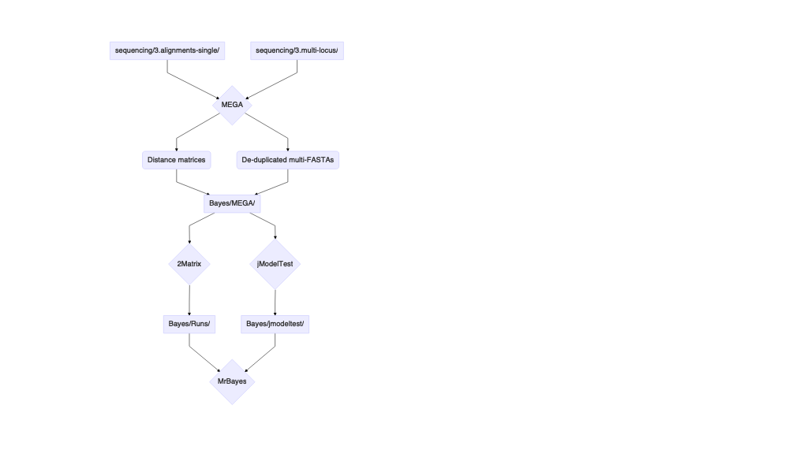

data-raw README
================

# Specimen Data

Records of voucher specimens on loan from lending herbaria (RM, NY, MO,
F, ISTC, MONTU, MONT, RSA-POM, UC, UTC, GH, US, CAS, IDS) were compiled
into an excel file,
[`specimens.xlsx`](https://github.com/jasonratcliff/ThesisPackage/blob/master/inst/extdata/specimens.xlsx).
Data recorded from vouchers include locality, identification history,
collector, collection number, date, institution, geographic coordinates,
elevation, any ecological descriptions, and measurements of continuous
and discrete specimen traits. In total, 1707 unique collections were
reviewed.

``` r
# Path to installed file with specimens annotations.
system.file("extdata/specimens.xlsx", package = "ThesisPackage") %>%
  stringr::str_extract(string = ., pattern = "extdata.+")
```

    ## [1] "extdata/specimens.xlsx"

The
[`herbarium_specimens.R`](https://github.com/jasonratcliff/ThesisPackage/blob/master/data-raw/specimens/herbarium_specimens.R)
script creates an *.Rda* from `specimens.xlsx`, formatting specimen data
for downstream phylogenetic, distribution, and morphological analyses to
define a tibble `herbarium_specimens` in the `ThesisPackage` namespace.

``` r
ThesisPackage::herbarium_specimens
```

    ## # A tibble: 1,712 x 66
    ##    excel_sheet prior_id prior_1 prior_2 prior_3 prior_4 Taxon Taxon_a_posteri…
    ##    <chr>       <chr>    <chr>   <chr>   <chr>   <chr>   <chr> <chr>           
    ##  1 P. Remaini… Physari… Physar… <NA>    <NA>    <NA>    Phys… <NA>            
    ##  2 P. Remaini… Physari… Physar… Physar… Physar… Physar… Phys… <NA>            
    ##  3 P. Remaini… Physari… Physar… Physar… Physar… Physar… Phys… <NA>            
    ##  4 P. Remaini… Physari… Physar… <NA>    <NA>    <NA>    Phys… <NA>            
    ##  5 P. Remaini… Physari… Physar… Physar… <NA>    <NA>    Phys… <NA>            
    ##  6 P. Remaini… Physari… Physar… Physar… <NA>    <NA>    Phys… <NA>            
    ##  7 P. Remaini… Physari… Physar… <NA>    <NA>    <NA>    Phys… <NA>            
    ##  8 P. Remaini… Physari… Physar… <NA>    <NA>    <NA>    Phys… <NA>            
    ##  9 P. Remaini… Physari… Physar… <NA>    <NA>    <NA>    Phys… <NA>            
    ## 10 P. Remaini… Physari… Physar… Physar… <NA>    <NA>    Phys… <NA>            
    ## # … with 1,702 more rows, and 58 more variables: Collector <chr>,
    ## #   Collection_Number <chr>, Date <chr>, Date_parsed <date>, Date_md <date>,
    ## #   Herbarium <chr>, State <chr>, County <chr>, Location <chr>, Latitude <dbl>,
    ## #   Longitude <dbl>, ID <chr>, App.A <chr>, Imaged <chr>, Elev_m <chr>,
    ## #   Elev_ft <chr>, Elev_var <chr>, Elev_raw <chr>, Elev_raw_min <dbl>,
    ## #   Elev_raw_max <dbl>, TRS1 <chr>, TRS2 <chr>, Rosulate <chr>, Caudex <chr>,
    ## #   Pubescence <chr>, Basal_leaf_trichomes <chr>, Fruit_trichomes <chr>,
    ## #   Stem_count <chr>, Stem_shape <chr>, Stem_length_dm <chr>, Petiole <chr>,
    ## #   Basal_leaf_length_cm <chr>, Basal_leaf_shape <chr>,
    ## #   Basal_leaf_margins <chr>, Cauline_leaf_length_mm <chr>,
    ## #   Cauline_leaf_shape <chr>, Cauline_leaf_margins <chr>, Racemes <chr>,
    ## #   Pedicel_shape <chr>, Pedicels_secund <chr>, Sepal_length_mm <chr>,
    ## #   Sepal_shape <chr>, Petal_color <chr>, Petal_length_mm <chr>,
    ## #   Petal_shape <chr>, Style_length_mm <chr>, Mature_fruit_length_mm <chr>,
    ## #   Mature_fruit_width_mm <chr>, Fruit <chr>, Mature_fruit_apices <chr>,
    ## #   Replum_pubescence <chr>, Inner_valve_pubescence <chr>, Ovule_number <chr>,
    ## #   Replum_shape <chr>, Seed_color <chr>, Seed_shape <chr>,
    ## #   Mature_seed_length_mm <chr>, Chromosomes <chr>

Briefly, the script does the following:

-   Read data into R using `readxl` ([Wickham and Bryan
    2019](#ref-R-readxl))
    -   Filter records with `dplyr` ([Wickham et al.
        2020](#ref-R-dplyr)) to annotations with:
        -   *Physaria*
        -   *Lesquerella*
        -   Brassicaceae
    -   Standardize dates with `lubridate` ([Spinu, Grolemund, and
        Wickham 2020](#ref-R-lubridate))
        -   New variable `Date_md` with month and day for phenology
        -   Log records mismatched with the date format `YYYY-MM-DD`
-   Split comma-separated prior annotations as separate variables
    -   Identification agreements denoted by “!” are substituted with ID
    -   Extract most recent annotations into a new column
        -   Replace recent annotations by synonym according to
            [O’Kane](#ref-OKane2010) ([2010](#ref-OKane2010))
-   Parse elevation data
    -   Cast as numeric and remove special characters
    -   Combine variables with m / ft. elevation data
    -   Split minimum and maximum values and convert m to ft.
-   Combine DNA specimen metadata from `specimens/dna_specimens.csv`
    -   Create *dna\_specimens.Rda* with tibble in the `ThesisPackage`
        namespace

# DNA Map

<div class="figure">


<p class="caption">
Sampled DNA Specimens. Distribution of specimens with prior
identifications and locations of DNA samples.
</p>

</div>

# DNA Sequence Analysis

## Fasta Concatenation

Multi-FASTA files for sequenced loci were assembled from sequence
chromatograms and deposited in the
[`inst/extdata/FASTA`](https://github.com/jasonratcliff/ThesisPackage/blob/master/inst/extdata/FASTA)
subdirectory. Here, `FASTA` headers are formatted with two fields
`accession` and `locus` following “&gt;.” A single whitespace separates
the sample accession from the name of the locus, for example:
`>PACUT_48 rITS` or `>PACUT_12821 rps`. Each `FASTA` file contains
sequences sampled from a single genetic locus, where the locus is
indicated in the second field of the `FASTA` headers.

``` r
# Assign list of raw FASTA files from installed external package data.
list.files(
  path = system.file("extdata/FASTA", package = "ThesisPackage"),
  full.names = TRUE
  ) %>%
  stringr::str_extract(string = ., pattern = "extdata.+")
```

    ## [1] "extdata/FASTA/rITS-combined_raw.fasta"
    ## [2] "extdata/FASTA/rps-combined_raw.fasta" 
    ## [3] "extdata/FASTA/ycf1-combined_raw.fasta"

The `Biostrings` package ([Pagès et al. 2020](#ref-R-Biostrings)) was
used to read in `FASTA` files as `DNAStringSet` objects, an S4 class
inheriting the `XString` subclass. Briefly, a list is assigned with
elements containing a single `DNAStringSet` read from each `FASTA` file.
The intersecting set of sequence headers among all `FASTA` files is
identified from the extracted `DNAStringSet` names attributes. New
subsets for each locus were indexed by the set of specimens sequenced
for all loci. Untrimmed, single locus `FASTA` files from
[`inst/extdata/FASTA`]() and `FASTA` files filtered to common specimens
in
[`data-raw/sequencing/sequencing/2.subset-fastas`](https://github.com/jasonratcliff/ThesisPackage/tree/master/data-raw/sequencing/2.subset-fastas)
were aligned using MAFFT version 7.306B ([Katoh and Standley
2013](#ref-Katoh2013)). The G-INS-i alignment ([Katoh et al.
2005](#ref-Katoh2005)) with iterative refinement and 1PAM / k=2
nucleotide scoring matrix were set as alignment parameters. Aligned
`FASTA` files were deposited in the
[`data-raw/sequencing/3.alignments-single/`](https://github.com/jasonratcliff/ThesisPackage/tree/master/data-raw/sequencing/3.alignments-single)
and
[`data-raw/sequencing/3.alignments-subset/`](https://github.com/jasonratcliff/ThesisPackage/tree/master/data-raw/sequencing/3.alignments-subset)
subdirectories. For the subset of samples with DNA sequence data from
all three sample loci, a concatenated multi-FASTA file was compiled
using the
[`data-raw/sequencing/fasta-concat.R`](https://github.com/jasonratcliff/ThesisPackage/blob/master/data-raw/sequencing/fasta-concat.R)
Rscript, written to
[`data-raw/sequencing/3.multi-locus/`](https://github.com/jasonratcliff/ThesisPackage/tree/master/data-raw/sequencing/3.multi-locus).

<!-- -->

## MEGA / MrBayes

Distance matrices were calculated from the full single-locus and subset
multi-locus alignment FASTA files to identify identical DNA sequences
using MEGA version 10.1.8 ([Kumar et al. 2018](#ref-Kumar2018);
[Stecher, Tamura, and Kumar 2020](#ref-Stecher2020)). Pairwise distances
were calculated by p-distance treating gaps as pairwise deletions.
Distance matrices and FASTA (*.fas*) files with combined headers for
duplicate DNA sequences were deposited in
[Bayes/MEGA/](https://github.com/jasonratcliff/ThesisPackage/tree/master/data-raw/Bayes/MEGA).
Non-identical single locus (rITS, *rps*, *ycf1*) and concatenated
multi-locus FASTA files were used as input for jModelTest ([Posada
2008](#ref-Posada2008)) to assess evolutionary model fit. Lastly,
alignment gaps were coded using 2matrix ([Salinas and Little
2014](#ref-Salinas2014)), a Perl script that implements “simple indel
coding” as described by [Simmons and Ochoterena](#ref-Simmons2000)
([2000](#ref-Simmons2000)). Partitioned NEXUS (*.nex*) files with
defined command blocks were deposited in
[Bayes/Runs/](https://github.com/jasonratcliff/ThesisPackage/tree/master/data-raw/Bayes/Runs).

<!-- -->

## BEAST

The `Biostrings` and `ape` ([Paradis and Schliep 2019](#ref-R-ape))
packages were used to read in the subset of specimen alignments from the
concatenated analysis and write `NEXUS` formatted alignment files. For
all three loci (rITS, *rps*, *ycf1*), alignments were imported into
`BEAUti` v2.6.3 ([Bouckaert et al. 2019](#ref-Bouckaert2019)) to
configure BEAST *.xml* files.

<!-- -->

BEAST v2.6.3 ([Bouckaert et al. 2019](#ref-Bouckaert2019)) results from
3 independed runs of 50M states were combined with `LogCombiner` v2.6.3
(*ibid.*) with 10,000 resampled states. A maximum clade credibility tree
was summarized using `TreeAnnotator` v2.6.3 (*ibid.*) and visualized
using the `ggplot2` ([Wickham 2020](#ref-R-ggplot2)) extension `ggtree`
([Yu et al. 2017](#ref-R-ggtree)).

<!-- -->

## Evolutionary Models

-   <https://github.com/ddarriba/modeltest/wiki/Models-of-Evolution>

| Locus | Partition | jModelTest | MEGA | Par. Finder | MrBayes | BEAST |
|:------|:----------|:-----------|:-----|:------------|:--------|:------|
| rITS  | 1-659     | TrNef      | HKY  | K80         | nst=1   | TN93  |
| rps   | 660-1605  | F81        | T92  | F81 + i     | nst=1   | JC69  |
| ycf1  | 1606-2162 | F81        | T92  | F81 + i     | nst=1   | JC69  |

## FASTA Summaries

Define a function to read *.fasta* extension files from a given file
path as `DNAStringSet` objects, then calculate the number of unique
sequence headers and minimum / maxium sequence lengths.

### Raw FASTAs

<table>
<thead>
<tr>
<th style="text-align:left;">
Locus
</th>
<th style="text-align:right;">
Sequences
</th>
<th style="text-align:right;">
Min Length
</th>
<th style="text-align:right;">
Max Length
</th>
</tr>
</thead>
<tbody>
<tr>
<td style="text-align:left;">
rITS
</td>
<td style="text-align:right;">
72
</td>
<td style="text-align:right;">
581
</td>
<td style="text-align:right;">
583
</td>
</tr>
<tr>
<td style="text-align:left;">
rps
</td>
<td style="text-align:right;">
66
</td>
<td style="text-align:right;">
802
</td>
<td style="text-align:right;">
852
</td>
</tr>
<tr>
<td style="text-align:left;">
ycf1
</td>
<td style="text-align:right;">
51
</td>
<td style="text-align:right;">
511
</td>
<td style="text-align:right;">
524
</td>
</tr>
</tbody>
</table>

### Subset FASTAs

<table>
<thead>
<tr>
<th style="text-align:left;">
Locus
</th>
<th style="text-align:right;">
Sequences
</th>
<th style="text-align:right;">
Min Length
</th>
<th style="text-align:right;">
Max Length
</th>
</tr>
</thead>
<tbody>
<tr>
<td style="text-align:left;">
rITS
</td>
<td style="text-align:right;">
51
</td>
<td style="text-align:right;">
581
</td>
<td style="text-align:right;">
583
</td>
</tr>
<tr>
<td style="text-align:left;">
rps
</td>
<td style="text-align:right;">
51
</td>
<td style="text-align:right;">
802
</td>
<td style="text-align:right;">
852
</td>
</tr>
<tr>
<td style="text-align:left;">
ycf1
</td>
<td style="text-align:right;">
51
</td>
<td style="text-align:right;">
511
</td>
<td style="text-align:right;">
524
</td>
</tr>
</tbody>
</table>

### Aligned (untrimmed)

<table>
<thead>
<tr>
<th style="text-align:left;">
Locus
</th>
<th style="text-align:right;">
Sequences
</th>
<th style="text-align:right;">
Min Length
</th>
<th style="text-align:right;">
Max Length
</th>
</tr>
</thead>
<tbody>
<tr>
<td style="text-align:left;">
rITS
</td>
<td style="text-align:right;">
72
</td>
<td style="text-align:right;">
586
</td>
<td style="text-align:right;">
586
</td>
</tr>
<tr>
<td style="text-align:left;">
rps
</td>
<td style="text-align:right;">
66
</td>
<td style="text-align:right;">
889
</td>
<td style="text-align:right;">
889
</td>
</tr>
<tr>
<td style="text-align:left;">
ycf1
</td>
<td style="text-align:right;">
51
</td>
<td style="text-align:right;">
524
</td>
<td style="text-align:right;">
524
</td>
</tr>
</tbody>
</table>

### Aligned (trimmed)

<table>
<thead>
<tr>
<th style="text-align:left;">
Locus
</th>
<th style="text-align:right;">
Sequences
</th>
<th style="text-align:right;">
Min Length
</th>
<th style="text-align:right;">
Max Length
</th>
</tr>
</thead>
<tbody>
<tr>
<td style="text-align:left;">
rITS
</td>
<td style="text-align:right;">
51
</td>
<td style="text-align:right;">
586
</td>
<td style="text-align:right;">
586
</td>
</tr>
<tr>
<td style="text-align:left;">
rps
</td>
<td style="text-align:right;">
51
</td>
<td style="text-align:right;">
889
</td>
<td style="text-align:right;">
889
</td>
</tr>
<tr>
<td style="text-align:left;">
ycf1
</td>
<td style="text-align:right;">
51
</td>
<td style="text-align:right;">
524
</td>
<td style="text-align:right;">
524
</td>
</tr>
</tbody>
</table>

# References

<div id="refs" class="references csl-bib-body hanging-indent">

<div id="ref-Bouckaert2019" class="csl-entry">

Bouckaert, Remco R, Timothy G Vaughan, Joëlle Barido-SottaniI, Sebastián
Duchêne, Mathieu Fourment, Alexandra Gavryushkina, Joseph Heled, et al.
2019. “BEAST 2.5: An Advanced Software Platform for Bayesian
Evolutionary Analysis.” *PLoS Computational Biology* 15 (4): e1006650.
<https://doi.org/10.1371/journal.pcbi.1006650>.

</div>

<div id="ref-Katoh2005" class="csl-entry">

Katoh, Kazutaka, Kei-ichi Kuma, Hiroyuki Toh, and Takashi Miyata. 2005.
“MAFFT Version 5: Improvement in Accuracy of Multiple Sequence
Alignment.” *Nucleic Acids Research* 33 (2): 511–18.

</div>

<div id="ref-Katoh2013" class="csl-entry">

Katoh, Kazutaka, and Daron M Standley. 2013. “MAFFT Multiple Sequence
Alignment Software Version 7: Improvements in Performance and
Usability.” *Molecular Biology and Evolution* 30 (4): 772–80.

</div>

<div id="ref-Kumar2018" class="csl-entry">

Kumar, Sudhir, Glen Stecher, Michael Li, Christina Knyaz, and Koichiro
Tamura. 2018. “MEGA X: Molecular Evolutionary Genetics Analysis Across
Computing Platforms.” *Molecular Biology and Evolution* 35 (6): 1547–49.

</div>

<div id="ref-OKane2010" class="csl-entry">

O’Kane, Steve L, Jr. 2010. “*Physaria*.” In *<span
class="nocase">Magnoliophya: Salicaceae to Brassicaceae</span>*, edited
by Flora of North America editorial committee, 1st ed., 7:616–65. <span
class="nocase">Flora of North America North of Mexico</span>. New York,
(NY): Oxford Univ. Press.

</div>

<div id="ref-R-Biostrings" class="csl-entry">

Pagès, H., P. Aboyoun, R. Gentleman, and S. DebRoy. 2020. *Biostrings:
Efficient Manipulation of Biological Strings*. Manual.

</div>

<div id="ref-R-ape" class="csl-entry">

Paradis, E., and K. Schliep. 2019. “Ape 5.0: An Environment for Modern
Phylogenetics and Evolutionary Analyses in R.” *Bioinformatics* 35:
526–28.

</div>

<div id="ref-Posada2008" class="csl-entry">

Posada, David. 2008. “<span class="nocase">jModelTest</span>:
Phylogenetic Model Averaging.” *Molecular Biology and Evolution* 25 (7):
1253–56.

</div>

<div id="ref-Salinas2014" class="csl-entry">

Salinas, Nelson R, and Damon P Little. 2014. “2Matrix: A Utility for
Indel Coding and Phylogenetic Matrix Concatenation.” *Applications in
Plant Science* 2 (1): 1300083. <https://doi.org/10.3732/apps.1300083>.

</div>

<div id="ref-Simmons2000" class="csl-entry">

Simmons, Mark P, and Helga Ochoterena. 2000. “Gaps as Characters in
Sequence-Based Phylogenetic Analyses.” *Systematic Biology* 49 (2):
369–81.

</div>

<div id="ref-R-lubridate" class="csl-entry">

Spinu, Vitalie, Garrett Grolemund, and Hadley Wickham. 2020. *<span
class="nocase">lubridate</span>: Make Dealing with Dates a Little
Easier*. Manual. <https://CRAN.R-project.org/package=lubridate>.

</div>

<div id="ref-Stecher2020" class="csl-entry">

Stecher, Glen, Koichiro Tamura, and Sudhir Kumar. 2020. “Molecular
Evolutionary Genetics Analysis (MEGA) for <span
class="nocase">macOS</span>.” *Molecular Biology and Evolution*.
<https://doi.org/10.1093/molbev/msz312>.

</div>

<div id="ref-R-ggplot2" class="csl-entry">

Wickham, Hadley. 2020. *<span class="nocase">ggplot2</span>: Elegant
Graphics for Data Analysis*. 3rd ed. New York, (NY): Springer-Verlag.
<https://ggplot2-book.org/>.

</div>

<div id="ref-R-readxl" class="csl-entry">

Wickham, Hadley, and Jennifer Bryan. 2019. *<span
class="nocase">readxl</span>: Read Excel Files*. Manual.
<https://CRAN.R-project.org/package=readxl>.

</div>

<div id="ref-R-dplyr" class="csl-entry">

Wickham, Hadley, Romain François, Lionel Henry, and Kirill Müller. 2020.
*<span class="nocase">dplyr</span>: A Grammar of Data Manipulation*.
Manual. <https://CRAN.R-project.org/package=dplyr>.

</div>

<div id="ref-R-ggtree" class="csl-entry">

Yu, Guangchuang, David Smith, Huachen Zhu, Yi Guan, and Tommy Tsan-Yuk
Lam. 2017. “<span class="nocase">ggtree</span>: An R Package for
Visualization and Annotation of Phylogenetic Trees with Their Covariates
and Other Associated Data.” *Methods in Ecology and Evolution* 8 (1):
28–36. <https://doi.org/10.1111/2041-210X.12628>.

</div>

</div>
