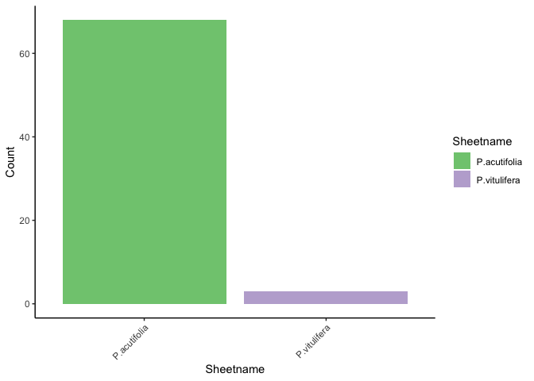
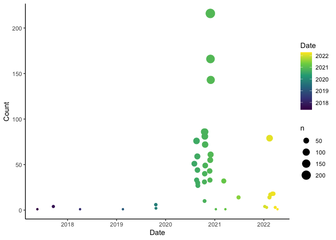

Appendix README
================

To facilitate formatting appendix files for specimens reviewed, an
Rscript was used to read in a column subset from each sheet name in the
`specimens.xlsx` external data from
[`thesis`](https://github.com/jasonratcliff/thesis). A *.tsv* file for
each sheet name in `specimens.xlsx` is written from entries without
appendix completion (missing values in variable `App.A`).

``` bash
Rscript appendix_script.R
```

<details>
<summary>
Missing Appendix Entries
</summary>
<p>

``` r
appendix_files <- list.files(pattern = "*_appendix.tsv")

missing_appendixes <- purrr::map_dfr(
  .x = appendix_files, function(appendix) {
    readr::read_tsv(file = appendix,
                    col_types = paste0(rep("c", times = 10), collapse = "")) %>%
      dplyr::mutate(
        sheetname = gsub(pattern = "_appendix.tsv", replacement = "",
                         x = appendix)
      )
  })

appendix_counts <- ggplot(data = missing_appendixes) +
  geom_bar(aes(x = sheetname, fill = sheetname)) +
  scale_fill_brewer("Sheetname", type = "qual") +
  theme_classic() +
  theme(axis.text.x = element_text(angle = 45, hjust = 1)) +
  labs(x = "Sheetname", y = "Count")

fs::file_delete(path = appendix_files)
rm(appendix_files, missing_appendixes)
```

</p>
</details>

<!-- -->

## Identifications

<details>
<summary>
Summarized Dates
</summary>
<p>

``` r
id_dates <- thesis::herbarium_specimens %>%
  dplyr::select(ID) %>%
  dplyr::mutate(
    Date = stringr::str_extract(
      string = .data$ID,
      pattern = "[0-9]{1,2}/[0-9]{1,2}/[0-9]{2}"
    ) %>% as.Date(x = ., format = "%m/%d/%y")
  ) %>%
  dplyr::filter(!is.na(Date)) %>%
  dplyr::group_by(Date) %>%
  dplyr::add_count(name = "Count")

id_plot <- ggplot(data = id_dates) +
  geom_count(aes(x = Date, y = Count, color = Date)) +
  scale_x_date() +
  scale_color_viridis_c(trans = "date") +
  theme_classic()
```

</p>
</details>

<!-- -->
